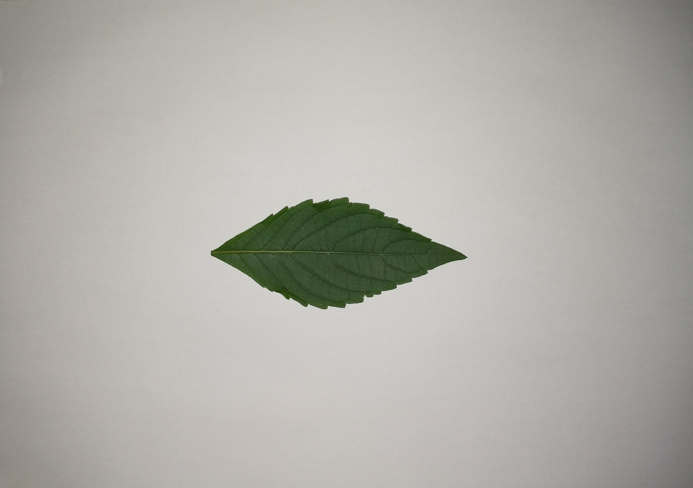

# Usando uma rede neural

## Introdução

A introdução seguir contem trechos do artigo *[Uma rede UNet modificada para segmentação e
identificação de lesões pulmonares em tomografias](https://bdm.unb.br/bitstream/10483/29884/1/2021_ThiagoAraujoDaSilva_tcc.pdf) por Thiago Araujo da Silva*  
___
Redes Neurais Artificiais, ou Artificial Neural Network (ANN), são modelos computacionais de aprendizado de máquina inspirados em redes neurais biológicas, projetados para simular a maneira como o cérebro humano processa as informações. As ANNs obtêm seu conhecimento detectando padrões e relacionamentos nos dados e aprendem através da experiência. Assim como uma rede neural biológica, a unidade básica da ANN é o neurônio. 

Uma rede com apenas um neurônio, chamada de Perceptron, é capaz de classificar padrões de forma extremamente limitada, pois agrupa apenas dados linearmente separáveis. Para escalar a rede e resolver problemas de maior magnitude, utiliza-se uma arquitetura mais robusta chamada de Rede Neural Multicamadas, ou Multilayer Perceptron (MLP). Uma MLP, consiste em um sistema de neurônios simplesmente conectados, distribuídos em camadas, podendo estas serem de entrada, ocultas ou de saída. Uma MLP com mais de uma camada oculta é denominada de Rede Neural Profunda, ou Deep
Artificial Neural Network.

Rede Neural Convolucional, ou Convolutional Neural Network (CNN), é um tipo especializado de rede neural profunda para processamento de dados que contém uma topologia em grid, onde, ao invés de simplesmente aplicar uma multiplicação matricial em suas camadas ocultas, aplica-se uma operação de convolução. As camadas de convolução trazem características muito importantes para a relevância dessa arquitetura, como invariância da escala, translação e outras transformações. Essas conseguem reconhecer padrões de forma mais robusta, permitindo a aplicação de técnicas de aumento de dados, ou Data Augmentation, e utilizar uma maior variedade e quantidade de dados de treinamento.  

Redes convolucionais são tipicamente utilizadas em tarefas de classificação, em que a saída para uma imagem é um rótulo de classe única. No entanto, em muitas tarefas visuais, especialmente no processamento de imagens biomédicas, a saída desejada deve incluir a localização, ou seja, um rótulo de classe deve ser atribuído a cada pixel. O objetivo da segmentação semântica é rotular cada pixel de uma imagem com uma classe que corresponda com o que está sendo representado. Como são feitas previsões para cada pixel da imagem, essa tarefa é comumente chamada de previsão densa. Uma questão importante a ser observada é que o sistema não separa categorias da mesma classe, ou seja, se existirem dois objetos diferentes da mesma classe em sua imagem de entrada, o mapa de segmentação não os distingue inerentemente como objetos separados. Para atingir a segmentação, é possível substituir a camada totalmente conectada por convoluções, gerando uma rede neural totalmente convolucional, ou Fully Convolutional Neural Network (FCNN).  

U-Net é uma rede neural convolucional que foi desenvolvida para segmentação de imagens biomédicas no Departamento de Ciência da Computação da Universidade de Freiburg. A rede é baseada na rede totalmente convolucional e sua arquitetura foi modificada e estendida para trabalhar com menos imagens de treinamento e gerar segmentações mais precisas.

Aqui sera utilizada uma rede tipo unet para classificar os pixels de fotos de folhas de arvores retiradas pelo [**THE SQUAD ou squad 3**](https://github.com/spinosaphb/cognitive-computing-projects/tree/develop)
durante o [Atlântico Academy Bootcamp 2022](https://www.atlantico.com.br/academy-bootcamp/), o objetivo é diferenciar a folha em destaque do resto da imagem

## Metodologia

**Ferramentas**
___

A rede neural convolucional e todo o pré-processamento dos dados foram implementados em Python (.py e .ipynb), utilizando bibliotecas como TensorFlow, Keras, NumPy, Pandas e OpenCV, controle versão foi feito com GIT/GITHUB, foram utilizados sistemas Windows 11 e Ubuntu 21

**Banco de imagens**
___

Foram 111 fotos (disponiveis no drive), retiradas sobre uma folha de papel A4, com flash (enquadrando a folha completamente), com a parte que recebe sol virada para cima e com seus talos/cabo retirados. Dessas 45 delas tem suas respectivas segmentações padrão ouro e 66 delas não. As imagens com segmentação foram usadas no treino e as sem como teste (avaliação visual). Foram utilizadas varias resoluções (no maximo FULL HD) mais sempre com a proporção 16:9. Na segmentação a cor preta (0, 0, 0) e considerado como fundo e branco (1, 1, 1) como parte da folha. Todas em formato jpg. Para identicar uma imagem e sua respectiva segmentação, foram usados os mesmos nomes em cada arquivo. As imagens estão disponiveis no link: <https://drive.google.com/drive/u/1/folders/1kfXMl4MBqpJSXTO51Qt9teGXopra7ggn>

**Pre-processamento**
___

* Resize (opcional)
* Preenchimento das bordas (para a imagem ficar quadrada)
* Normalização ([0,1])

**Arquitetura**
___

A rede neural convolucional escolhida como base para a realização dos experimentos foi a UNet, devido a sua ampla utilização em tarefas de segmentação contendo baixa quantidades de dados de treinamento (detalhes de arquitetura foram suprimidos aqui devido ao tamanho do modelo, para mais detalhes de arquitetura consultar o repositorio).  

O treinamento bem-sucedido de redes profundas requer milhares de exemplos de treinamento. A UNet, apresenta uma rede e estratégia de treinamento que se baseia no forte uso de aumento de dados para usar as amostras disponíveis de forma mais eficiente.  
Montada a partir de uma FCNN (Fully Convolutional Neural Network), a arquitetura foi modificada e estendida de modo a necessitar de pouquíssimas imagens de treinamento e produzindo segmentações mais precisas.
A rede não possui nenhuma camada totalmente conectada e usa apenas a parte válida de cada convolução, ou seja, o mapa de segmentação contém apenas os pixels para os quais o contexto completo está disponível na imagem de entrada.

Para o treinamento foram utilizadas 150 epocas de treino com interrupção com 10 epocas seguidas sem melhora na função de erro o treinamento é interrompido e os melhores pesos são recuperados, as imagens são apresentadas em batches de 64 imagens.  

**Avaliação**
___

Para avaliar vou usar como exemplo o **modelo treinado usando imagens 160 x 288, k=5**.
A metrica utilizada foi o [IOU](https://towardsdatascience.com/intersection-over-union-iou-calculation-for-evaluating-an-image-segmentation-model-8b22e2e84686) nela esta rede teve score_IOU de **.99 medio** para as 45 imagens com segmentação padrão ouro e com resultados visualmente perfeitos em sua maioria nas imagens sem a segmentações padrão ouro.

## Métricas

___
**IOU medio - 0.9900660255733544**
| Original file name | area_em_pixels | altura_em_pixels | largura_em_pixels | IOU | Resolução
| --- | --- | --- | --- | --- | --- |
|       27.jpg       |      2137      |        97        |         28        | 0.9957884885353299 | 160 x 288 |
|       24.jpg       |      182       |        25        |         9         | 0.967032967032967  | 160 x 288 |
|       11.jpg       |      1296      |        70        |         31        | 0.9809741248097412 | 160 x 288 |
|       07.jpg       |      1770      |       128        |         23        | 0.9826233183856502 | 160 x 288 |
|       34.jpg       |      2514      |       109        |         36        | 0.9960270162892332 | 160 x 288 |
|       33.jpg       |      2289      |        98        |         36        | 0.9965050240279598 | 160 x 288 |
|       41.jpg       |      4009      |       118        |         95        | 0.9977578475336323 | 160 x 288 |
|       43.jpg       |      4866      |       128        |         96        | 0.9948717948717949 | 160 x 288 |
|       06.jpg       |      1761      |        91        |         27        | 0.9931972789115646 | 160 x 288 |
|       01.jpg       |      5590      |       141        |         57        | 0.9900638750887154 | 160 x 288 |
|       44.jpg       |      4279      |       126        |         88        | 0.9948682062048052 | 160 x 288 |
|       23.jpg       |      196       |        28        |         8         | 0.9948979591836735 | 160 x 288 |
|       36.jpg       |      2163      |        70        |         44        | 0.992633517495396  | 160 x 288 |
|       30.jpg       |      1939      |       107        |         25        | 0.9943298969072165 | 160 x 288 |
|       18.jpg       |      4922      |       124        |         54        | 0.9933184855233853 | 160 x 288 |
|       42.jpg       |      5631      |       142        |        107        | 0.9953867991483322 | 160 x 288 |
|       17.jpg       |      5764      |       174        |         49        | 0.9922252937111264 | 160 x 288 |
|       29.jpg       |      1821      |       103        |         26        | 0.9939659901261657 | 160 x 288 |
|       22.jpg       |      205       |        28        |         9         | 0.9902439024390244 | 160 x 288 |
|       37.jpg       |      3694      |        88        |         61        | 0.9956709956709957 | 160 x 288 |
|       10.jpg       |      1191      |        67        |         24        | 0.9933054393305439 | 160 x 288 |
|       16.jpg       |      6429      |       206        |         50        | 0.9899052647926697 | 160 x 288 |
|       35.jpg       |      2256      |       106        |         35        | 0.9964554718653079 | 160 x 288 |
|       05.jpg       |      5204      |       134        |         64        | 0.9870574800152265 | 160 x 288 |
|       12.jpg       |      4027      |       131        |         43        | 0.9683929005592026 | 160 x 288 |
|       25.jpg       |      221       |        29        |         10        | 0.9684684684684685 | 160 x 288 |
|       02.jpg       |      5627      |       181        |         50        | 0.9901234567901235 | 160 x 288 |
|       20.jpg       |      5889      |       258        |         33        | 0.9842666215530367 | 160 x 288 |
|       38.jpg       |      3137      |        87        |         55        | 0.9929913985345652 | 160 x 288 |
|       39.jpg       |      3898      |        96        |         61        | 0.9964084145715751 | 160 x 288 |
|       19.jpg       |      3062      |       151        |         34        | 0.9905691056910569 | 160 x 288 |
|       26.jpg       |      2711      |       113        |         33        | 0.9789745481372187 | 160 x 288 |
|       13.jpg       |      1151      |        59        |         28        | 0.9819897084048027 | 160 x 288 |
|       08.jpg       |      3263      |        96        |         49        | 0.9902528175449284 | 160 x 288 |
|       28.jpg       |      1938      |        99        |         27        | 0.9974200206398349 | 160 x 288 |
|       40.jpg       |      3181      |        83        |         58        | 0.9949748743718593 | 160 x 288 |
|       15.jpg       |      1054      |       100        |         15        | 0.9839622641509433 | 160 x 288 |
|       21.jpg       |      150       |        22        |         9         | 0.9933333333333333 | 160 x 288 |
|       04.jpg       |      7097      |       161        |         65        | 0.9905964912280701 | 160 x 288 |
|       09.jpg       |      1424      |        88        |         25        | 0.9840388619014573 | 160 x 288 |
|       45.jpg       |      2613      |        77        |         51        | 0.9973221117061974 | 160 x 288 |
|       32.jpg       |      2134      |        99        |         33        | 0.9957904583723106 | 160 x 288 |
|       31.jpg       |      2673      |       105        |         41        | 0.9973851326111318 | 160 x 288 |
|       14.jpg       |      6251      |       186        |         51        | 0.9897828863346104 | 160 x 288 |
|       03.jpg       |      8000      |       207        |        102        | 0.9868208379957727 | 160 x 288 |

**Imagens sem segmentação ouro**

| Original file name | area_em_pixels_predita | altura_em_pixels_predita | largura_em_pixels_predita | Resolução |
| --- | --- | --- | --- | --- |
| ORIGINAL (59).jpg  |          1511          |            87            |             26            | 160 x 288 |
| ORIGINAL (58).jpg  |          1477          |            82            |             30            | 160 x 288 |
| ORIGINAL (38).jpg  |          1447          |            46            |             40            | 160 x 288 |
| ORIGINAL (18).jpg  |          5594          |           160            |             55            | 160 x 288 |
| ORIGINAL (65).jpg  |          2692          |           115            |             36            | 160 x 288 |
| ORIGINAL (57).jpg  |          2310          |            95            |             35            | 160 x 288 |
| ORIGINAL (28).jpg  |          5765          |           172            |             57            | 160 x 288 |
| ORIGINAL (46).jpg  |          3065          |           137            |             37            | 160 x 288 |
| ORIGINAL (16).jpg  |         11090          |           131            |            107            | 160 x 288 |
| ORIGINAL (10).jpg  |          2970          |            92            |             42            | 160 x 288 |
| ORIGINAL (55).jpg  |         17325          |           246            |             89            | 160 x 288 |
|  ORIGINAL (9).jpg  |          3020          |           125            |             36            | 160 x 288 |
| ORIGINAL (15).jpg  |          2424          |           126            |             32            | 160 x 288 |
| ORIGINAL (36).jpg  |          2172          |            94            |             38            | 160 x 288 |
| ORIGINAL (37).jpg  |          1195          |            75            |             23            | 160 x 288 |
| ORIGINAL (32).jpg  |          4060          |           150            |             43            | 160 x 288 |
| ORIGINAL (23).jpg  |          2379          |           113            |             32            | 160 x 288 |
| ORIGINAL (66).jpg  |          2475          |           105            |             35            | 160 x 288 |
|  ORIGINAL (3).jpg  |          982           |            58            |             24            | 160 x 288 |
| ORIGINAL (26).jpg  |          1847          |            82            |             38            | 160 x 288 |
| ORIGINAL (48).jpg  |          4271          |           108            |             50            | 160 x 288 |
| ORIGINAL (51).jpg  |          3669          |            96            |             51            | 160 x 288 |
|  ORIGINAL (4).jpg  |          872           |            55            |             24            | 160 x 288 |
| ORIGINAL (61).jpg  |          3059          |           134            |             36            | 160 x 288 |
| ORIGINAL (17).jpg  |          8349          |           196            |             68            | 160 x 288 |
| ORIGINAL (13).jpg  |         12888          |           176            |            109            | 160 x 288 |
| ORIGINAL (60).jpg  |          1794          |           117            |             27            | 160 x 288 |
| ORIGINAL (24).jpg  |          1404          |            87            |             33            | 160 x 288 |
| ORIGINAL (56).jpg  |          2316          |            96            |             34            | 160 x 288 |
| ORIGINAL (52).jpg  |          3133          |            96            |             43            | 160 x 288 |
| ORIGINAL (35).jpg  |          1498          |            78            |             29            | 160 x 288 |
| ORIGINAL (27).jpg  |          1046          |            61            |             29            | 160 x 288 |
|  ORIGINAL (8).jpg  |          1289          |            80            |             24            | 160 x 288 |
| ORIGINAL (20).jpg  |          3898          |           145            |             44            | 160 x 288 |
| ORIGINAL (22).jpg  |          5757          |           164            |             56            | 160 x 288 |
| ORIGINAL (42).jpg  |          673           |            49            |             19            | 160 x 288 |
| ORIGINAL (40).jpg  |          1027          |            84            |             20            | 160 x 288 |
| ORIGINAL (62).jpg  |          137           |           284            |            287            | 160 x 288 |
| ORIGINAL (11).jpg  |          1861          |           104            |             27            | 160 x 288 |
| ORIGINAL (19).jpg  |          4409          |           156            |             46            | 160 x 288 |
|  ORIGINAL (6).jpg  |          2157          |           103            |             33            | 160 x 288 |
| ORIGINAL (34).jpg  |          1615          |            83            |             30            | 160 x 288 |
| ORIGINAL (30).jpg  |          5369          |           162            |             53            | 160 x 288 |
| ORIGINAL (43).jpg  |         18113          |           245            |            157            | 160 x 288 |
| ORIGINAL (12).jpg  |         13133          |           176            |            111            | 160 x 288 |
| ORIGINAL (39).jpg  |          2165          |            90            |             36            | 160 x 288 |
| ORIGINAL (29).jpg  |          813           |            64            |             20            | 160 x 288 |
|  ORIGINAL (1).jpg  |          5731          |           123            |             72            | 160 x 288 |
| ORIGINAL (64).jpg  |         12481          |           162            |            107            | 160 x 288 |
| ORIGINAL (54).jpg  |         17030          |           243            |             87            | 160 x 288 |
| ORIGINAL (33).jpg  |          1964          |            49            |             48            | 160 x 288 |
| ORIGINAL (47).jpg  |          2303          |            96            |             35            | 160 x 288 |
|  ORIGINAL (5).jpg  |          601           |            52            |             17            | 160 x 288 |
| ORIGINAL (21).jpg  |          1292          |            59            |             34            | 160 x 288 |
| ORIGINAL (31).jpg  |          1233          |            75            |             27            | 160 x 288 |
| ORIGINAL (63).jpg  |          2024          |            65            |             38            | 160 x 288 |
| ORIGINAL (44).jpg  |         16289          |           220            |            156            | 160 x 288 |
| ORIGINAL (45).jpg  |          3014          |           106            |             42            | 160 x 288 |
| ORIGINAL (41).jpg  |          2157          |            55            |             48            | 160 x 288 |
| ORIGINAL (25).jpg  |          4622          |           162            |             48            | 160 x 288 |
| ORIGINAL (50).jpg  |          2025          |            75            |             34            | 160 x 288 |
| ORIGINAL (53).jpg  |         10554          |           183            |             73            | 160 x 288 |
| ORIGINAL (14).jpg  |          2534          |            82            |             41            | 160 x 288 |
| ORIGINAL (49).jpg  |          2540          |            82            |             40            | 160 x 288 |
|  ORIGINAL (7).jpg  |          2024          |           103            |             30            | 160 x 288 |
|  ORIGINAL (2).jpg  |          2699          |           115            |             36            | 160 x 288 |

## Conclusão

Apenas custosa no treino a rede se mostrou uma tecnica extremamente eficiente com otimos resultados mesmo com um banco de imagens tão limitado, chegando a identificar pequenos buracos e fissuras nas folhas.

### Limitações e melhorias

Sobre esse topico tenho alguns topicos a abordar:

* Segmentação de imagem é uma tarefa extremante dificil e fica claro que o otimo desempenho tem tambem haver com o dominio abordado, em um ambiente controlado com imagens nitidas com um fundo padrão, isso permitiu a rede atingir resultados que beiram metricas perfeitas sem um estudo profundo sobre o problema abordado.
* Mesmo sendo estipulado a retirada do talo da folha algumas fotos foram retiradas com talo e isso se provou um desafio para essa tecnica ja que na segmentação gold o talo é considerado fundo, em alguns casos a rede foi capaz de identificar o cabo como fundo, mais em outras apenas parte do talo foi corretamente classificado.

* Devido a individualidades das folhas algumas tem caracteristicas reflexivas que causam uma mancha branca na foto, na maioria dos casos isso contornado pela rede, mas em um caso especifico...

## Referencias

[1] SILVA, Thiago Araujo da. Uma rede UNet modificada para segmentação e identificação de lesões pulmonares em tomografias. Disponivel em: <https://bdm.unb.br/bitstream/10483/29884/1/2021_ThiagoAraujoDaSilva_tcc.pdf> Acesso em 20 jun. de 2022  

[2] CAVALCANTE, Matheus Coutinho. SEGMENTAÇÃO DE IMAGENS DE LESÕES DE PELE USANDO A REDE NEURAL CONVOLUCIONAL U-NET. Disponivel em: <https://ele.ufes.br/sites/engenhariaeletrica.ufes.br/files/field/anexo/projeto_de_graduacao_ii_-_matheus_coutinho_cavalcantes.pdf>  Acesso em 22 jun. de 2022

[3] TENSORFLOW documentation, segmentation example: <https://www.tensorflow.org/tutorials/images/segmentation?hl=pt-br> Acesso em 22 jun. de 2022

[4] pyimagesearch, U-Net Image Segmentation in Keras: <https://pyimagesearch.com/2022/02/21/u-net-image-segmentation-in-keras/>  Acesso em 23 jun. de 2022
